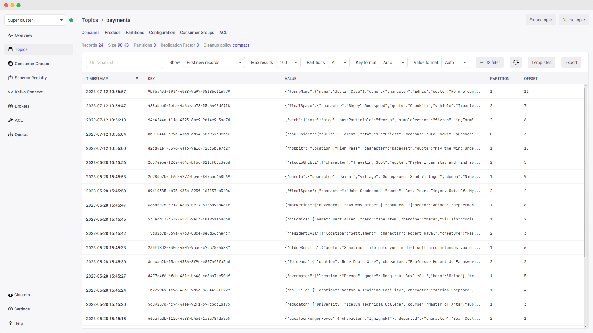
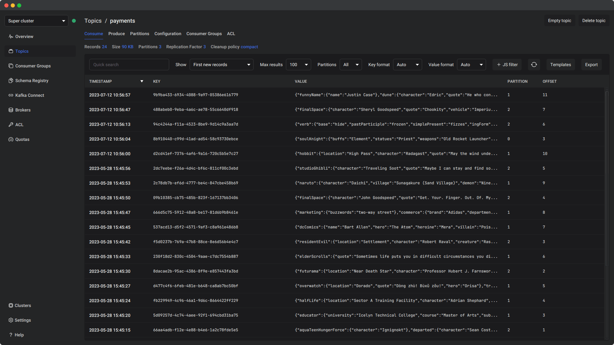

<div align="center">
    <a href="https://prafka.com/desktop"></a>
    <h1>PRAFKA</h1>
    <h3>Open source, cross-platform GUI for manage, explore and analyze Apache Kafka</h3>
    <a href="https://prafka.com/desktop#demo">Demo</a> | <a href="https://docs.prafka.com/desktop">Docs</a> | <a href="https://prafka.com/desktop#download">Download</a> 
</div>
<br />





## Capabilities

### Clusters

- Configure connection to Apache Kafka, Schema Registry and Kafka Connect

### Messages

- Filter by time, offset and partitions
- Search by key and payload using JavaScript functions
- Save search templates
- Avro, Protobuf and JSON support
- Export messages
- Produce messages

### Topics

- Search, create, edit, clean and delete topics
- Search, publish and export messages
- View partitions, offsets, occupied space and brokers
- View and edit configuration parameters
- View consumer groups and ACL

### Consumer Groups

- Search, create and delete groups
- View offsets and lags
- Edit offsets within topics and partitions

### Brokers

- View configuration parameters and storage directories

### ACL

- Search, create and delete ACL

### Quotas

- Manage producer_byte_rate, consumer_byte_rate
- Manage connection_creation_rate, controller_mutation_rate, request_percentage

### Schema Registry

- Search, create, edit and delete schemas and versions
- Change compatibility

### Kafka Connect

- Search, create, edit and delete connectors
- Manage the status of connectors and tasks

## Build from sources

### Requirements for all platforms

- JDK 25 with OpenJFX, for example, [Liberica Full JDK 25.0.1](https://github.com/bell-sw/Liberica/releases/tag/25.0.1%2B13)
- Maven

### Requirements for macOS

- [Homebrew](https://github.com/Homebrew/brew)

### Requirements for Linux

- [appimagetool](https://github.com/AppImage/appimagetool/releases) (*exists in [`desktop/distribution/linux/soft`](desktop/distribution/linux/soft)*)
- [type2-runtime](https://github.com/AppImage/type2-runtime/releases) for appimagetool (*exists in [`desktop/distribution/linux/soft`](desktop/distribution/linux/soft)*)

#### deb

```bash
sudo apt install desktop-file-utils fakeroot binutils
```

#### rpm

```bash
sudo dnf install rpm-build
```

### Requirements for Windows

- [WiX Toolset](https://github.com/wixtoolset/wix/releases) (*needs to install manually*)
- [lessmsi](https://github.com/activescott/lessmsi/releases) (*exists in [`desktop/distribution/win/soft`](desktop/distribution/win/soft)*)

### Build

```bash
mvn -pl core,desktop clean package
```

Artifact will be in folder [`desktop/target/distribution`](desktop/target/distribution)

## Development mode

### Compile

```bash
mvn -pl core,desktop clean compile
```

### Main class

```
com.prafka.desktop.Application
```

### VM options

```
-Dsun.awt.disablegrab=true 
--add-opens=javafx.controls/javafx.scene.control.skin=ALL-UNNAMED 
--add-exports=javafx.graphics/com.sun.javafx.application=ALL-UNNAMED 
--add-exports=javafx.graphics/com.sun.glass.ui=ALL-UNNAMED
```

### CLI arguments

```
--userDataDir=desktop/target 
--userLogDir=desktop/target 
--logConsoleEnabled=true 
--trackStageSize=false
```

## Peculiarities

To reduce the size of the final artifact, were added some libraries to the source code:

- [`com.ibm.icu.text`](core/src/main/java/com/ibm/icu/text): https://github.com/unicode-org/icu/tree/main/icu4j/main/core/src/main/java/com/ibm/icu/text
- [`org.bouncycastle`](core/src/main/java/org/bouncycastle): https://github.com/bcgit/bc-java/tree/main/core/src/main/java/org/bouncycastle
- [`org.apache.kafka.coordinator`](core/src/main/java/org/apache/kafka/coordinator): generated from https://github.com/apache/kafka/tree/4.0.1/group-coordinator/src/main/resources/common/message and https://github.com/apache/kafka/tree/4.0.1/transaction-coordinator/src/main/resources/common/message